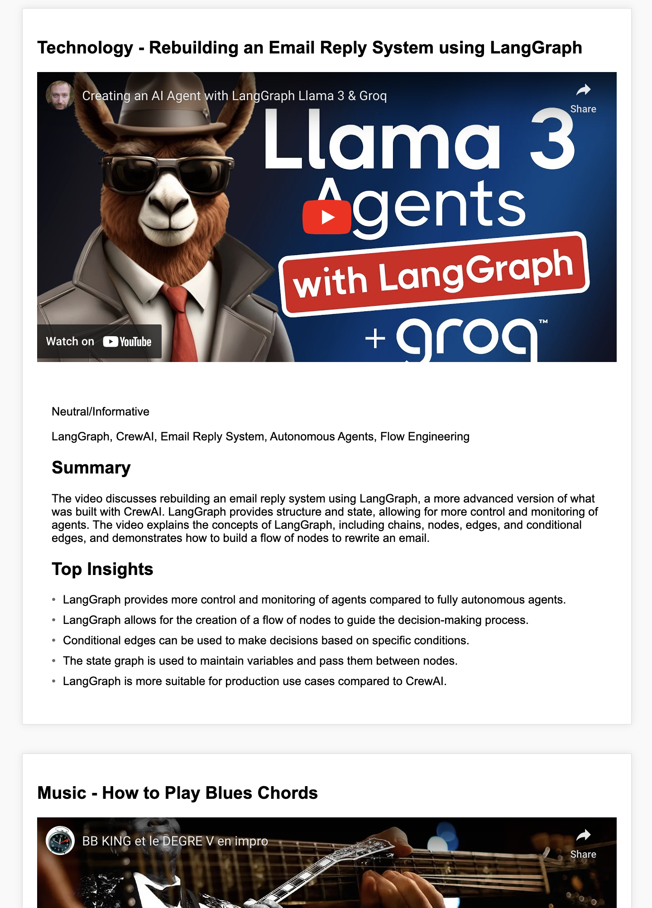

# YouTube Summary

Get all your YouTube video summaries from your YouTube subscriptions in one place.

## YouTube API

To use the YouTube API, you need to create a project in the Google Developers Console and enable the YouTube Data API v3. You will also need to create an OAuth 2.0 client ID and download the client secret file. You can find more information on how to do this [here](https://developers.google.com/youtube/registering_an_application).
The OAuth 2.0 client ID file should be named `client_secret_yt.json` and placed in the root of the project.

## CrewAI

This project is powered by CrewAI. CrewAI is a platform that allows you to create and deploy AI models without writing any code. You can find more information on CrewAI [here](https://crewai.com/).
The AI models are running in groq cloud [here](https://console.groq.com/playground). You need to setup your groq account (currently free) and have an env var named `GROQ_API_KEY` with your API key.

## How to use

1. Clone the repository
2. Setup your google API and Groq account as explained above.
3. Install the dependencies with `pip install -r requirements.txt`
4. Run the script with `python summarize.py`

By default the script will look for the past 24h. 

## Screenshots

